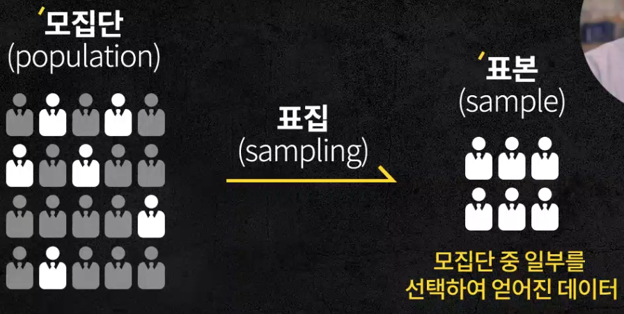

# 3. 모집단(population)과 랜덤샘플링, 편향(bias)

### 요구조건(목적)

- 어떤 결과를 어떻게 얻고싶은지에 따라 질이 좋은 데이터 얻을 수 있음
- 샘플링 방식에 따라 특성이 달라짐

 

## 통계학에서 데이터를 모으는 방법

- 데이터는 표 형태여야 분석 가능

- **모집단(population)**
  - 요구조건에 맞춰 필요한 모든 데이터 집단
  - 원래 구하고 싶은 데이터 전체
  - 샘플링 방법에 따라 샘플의 특성이 달라짐
- 부분으로 전체를 유추
  - **표본(sample)**
    - 모집단의 특성을 파악하기 위해 일부만 뽑아낸 데이터
  - **표집(sampling)**
    - 모집단에서 표본을 뽑아내는 과정
  - **표집수(N)**
    - 정확히 몇 개를 뽑을 것인가
    - 모집단에서 샘플링 할 때 몇 개의 데이터를 얻었는지

- 대표적인 샘플링 방법
  - **무선표집(랜덤샘플링)**
    - 기준 두지 않고 무작위(난수)로 샘플링(추출)

 

## 편향(bias)

- 특정 기준을 두고 샘플링해서 데이터가 한 쪽으로 치우치는 현상
- 특정 기준에 따라 편파된 데이터
- 양보다 질이 중요함
- **불편향(unbiased) 데이터**가 질 좋은 데이터
  - 우리의 목표하는 샘플 데이터
  - ex) **랜덤샘플링**
    - 샘플링 시 기준을 두지 않고 무작위로 추출하는 과정
    - 편향을 막을 수 있는 대표적인 방법