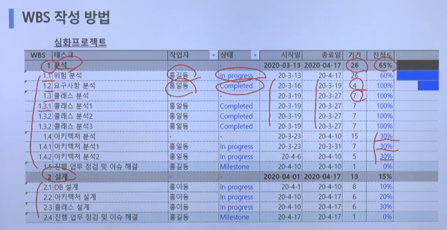

# WBS(Work Breakdown Structure)

- WBS 이론은 1960년대 미국에서 개발되어, 우리에게는 '**작업분할**' 또는 '**계층분할**'이란 말로 일반화된 이론
- "종합적으로 Work을 정의하고 관리 가능한 Work의 하부단위로 분할을 가능하게 하는 기법"
- 각각의 Work Item들의 구성체계를 말하며, 일반적으로 각 Work Item별로 계획과 집행대비가 용이하게 구성되는 것이 바람직

 

## WBS 역할

- 전체 큰 업무를 분류하여 구성 요소로 만든 후에 각 요소를 평가, 일정별 계획, 그것을 완수할 수 있는 사람에게 할당해주는 역할을 수행

1. 프로젝트에서 수행할 업무를 식별

   프로젝트의 시작은 프로젝트 관리자 임명에서 시작되며, 프로젝트의 주 관리자인 PM이 프로젝트의 모든 예산을 수립하는데, 이러한 예산은 요구사항에 근거한 작업범위로 산출

   PM이 WBS에 근거하여 업무를 식별한 후에 파악 가능

2. 일정과 원가, 자원요구사항

   WBS는 프로젝트의 작업에 대한 일정/원가를 산정하는 기초자료가 되며, 예상 못한 작업이나 누락된 작업들로 인한 일정지연 및 비용지출을 예방

3. 일정 계획과 산정

   직무할당표로 어떤 일을 누가 무엇을 가지고 먼저 할지를 정해야 하는 것을 도와줌

4. 전체일정 진행상황 파악

   팀원들은 자신에게 할당된 태스크를 쉽게 식별하고 프로젝트 매니저들은 작업 패키지를 체크 리스트로 사용해 어떤 작업이 완성되었고 어떤 작업이 남아있는지를 알아볼 수 있음

5. 프로젝트의 정보 추적 통제

   프로젝트 중간에 변경이 발생하면 이를 WBS로 통제 관리 할 수 있음 

6. 고객, 팀 간의 의사소통 링크

   프로젝트의 모든 인원이 각 작업에 대한 세부작업과 담당자를 쉽게 식별할 수 있으며 전체를 볼 수 있는 안목도 제공

   요구사항 변경 발생시 가장 먼저 체크해보아야할 정도로 좋은 의사소통 도구로서 작용함

 

## WBS 구축의 목적

- 수행하는 활동을 분할하고 정의하는 과정에서 프로젝트에 대한 이해 개선
- 일정 및 자원 소요량의 예측 정확도 개선
- 세분화된 작업을 기준으로 업무를 할당할 수 있어 효과적 관리가 가능
- 표준화된 프로젝트 절차를 활용함으로써 의사소통 개선
- 작업의 논리 관례를 파악
- 진행중인 작업들을 효율적으로 통제
- 비용과 일정 연계 관리의 기준으로 활용
- 전사적 자료 축적 및 효율적 관리

 

## 결론

### 개발자는 작성할 줄 알아야 한다

- 프로젝트가 어떻게 만들어지고 관리되는지 알면 다른 역할자에 대한 이해도 증가
- 실무에서는 직접 소규모 프로젝트를 리딩할 기회가 생김
- 관리 직군으로 가는 경우에는 작성 능력이 반드시 필요함 