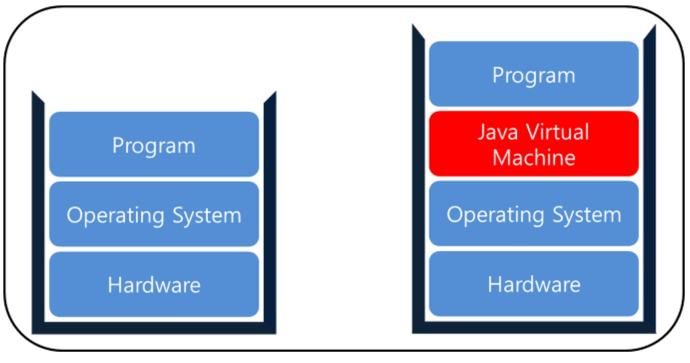

# JVM(자바 가상 머신, Java Virtual Machine)

- 자바프로그램은 운영체제 위의 JVM 위에서 동작
  - 운영체제에 상관없이 실행됨
- 일반적인 프로그램 실행구조와 JAVA 프로그램 실행구조
- 
- JVM 위에서 동작하기 위해서는 자바 바이트코드 필요
  - 자바 바이트코드 : 개발자에 의해 작성된 자바 소스코드(.java)를 자바컴파일러(javac)로 변환한 코드(.class)

- JAVA와 OS사이에서 중개자 역할을 수행하여 운영체제에 독립적인 플랫폼을 갖게함
- GC(Garbage Collection)등의 기능을 제공
  - 프로그램의 Memory 관리를 알아서 해줌
- 자바 애플리케이션을 클래스 로더를 통해 읽어 들여 자바 API와 함께 실행하는 것

 

###  JVM 실행과정

1. 프로그램이 실행되면 JVM은 OS로부터 이 프로그램이 필요로 하는 메모리를 할당 받음

   JVM은 이 메모리를 용도에 따라 여러 영역으로 나누어 관리

2. 자바 컴파일러(javac)가 자바소스(.java)코드를 읽어 들여 자바 바이트코드(.class)로 변환

3. 변경된 Class 파일들을 Class Loader를 통해 JVM 메모리영역(Runtime Data Areas)으로 로딩

4. 로딩된 class파일들은 Execution engine을 통해 해석

5. 해석된 바이트코드는 Runtime Data Areas에 배치되어 실질적으로 수행
   이러한 실행과정에서 필요에 따라 Thread Synchronization과 GC같은 관리 작업 수행

 

### Garbage Collection

-  Java Application에서 사용하지 않는 메모리를 자동으로 수거
- 개발자는 별도의 메모리 관리가 필요 없어 비지니스 로직에 집중할 수 있음

#### GC의 실행순서

- 참조되지 않은 객체들을 탐색 후 삭제
- 삭제된 객체의 메모리를 반환
- Heap 메모리의 재사용

  

### 참고 사이트

https://minwan1.github.io/2018/06/06/2018-06-06-Java,JVM/

https://preamtree.tistory.com/2